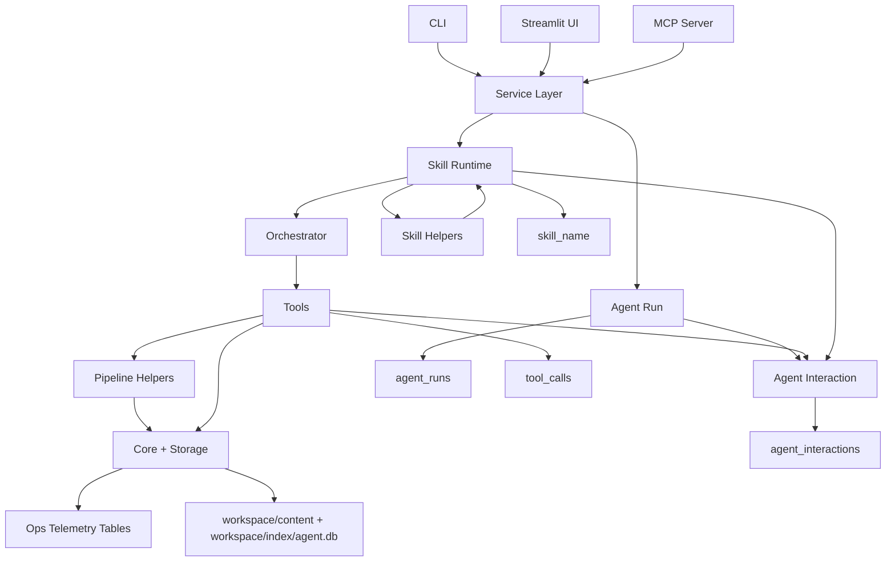

# AgentLab — Project Overview & Design Intent

## Purpose

AgentLab is a **local-first, human-in-the-loop agent system** designed to support an applied research team.
Its goal is to **augment human research and sensemaking**, not replace it.

The system continuously:
- searches for external information (primarily internet sources),
- extracts and normalizes content,
- categorizes and indexes it,
- maintains a persistent backlog of human-generated ideas/problems,
- matches research findings to those ideas/problems,
- scores relevance on a 0–10 scale,
- presents results for **human review, scoring, and correction**,
- plans and tracks execution to completion, including prioritization, backlog management, and agent/human assignment.

This is intentionally **not** an autonomous system. Humans remain the final judges.

---

## Core Design Principles

1. **Local-first**
   - Runs entirely on a developer laptop by default
   - SQLite for structured state
   - Markdown + YAML for content of record
   - Optional local LLMs (Ollama)

2. **Human-legible artifacts**
   - Every document, idea, and match is a `.md` file with YAML frontmatter
   - Humans can open, edit, correct, and re-run agents on edited content

3. **Strong provenance**
   - Every artifact includes a `source` block (free-form text)
   - Internet content includes URLs + retrieval timestamps
   - Ideas include proposer and originating context

4. **Separation of concerns**
   - Skills are small, explicit, reusable units
   - Orchestration (planner/controller) is separate from skills
   - Storage/indexing is separate from reasoning

5. **Human-in-the-loop scoring**
   - Agents suggest relevance and categorization
   - Humans review and assign final scores (0–10)
   - Human edits feed back into future agent runs

---

## Current Capabilities (v0)

### Artifacts
- **Document**
  - Internet-sourced or synthesized content
  - Stored as `doc.md`
- **Idea / Problem**
  - One idea per record
  - Stored as `idea.md`
- **Match**
  - Relationship between an idea and a document
  - Includes:
    - matchness score (0–10)
    - short reasons
    - optional sub-scores (novelty, credibility, actionability)
- **Task**
  - Execution plan for a reviewed match
  - Includes status (pending/in_progress/completed), priority, assigned agent, due date
  - Stored in SQLite `tasks` table, linked to matches

### Storage
- **Markdown + YAML frontmatter** = system of record
- **SQLite** = searchable index and relational glue
- SQLite enforces **foreign key integrity**
- Search runs are stored in SQLite (`runs` table) for UI/CLI selection

### Matching
- Bidirectional:
  - idea → documents
  - document → ideas
- Default heuristic scoring
- Optional LLM-based scoring (local via Ollama)
- Scores are explainable, not opaque embeddings

### Interface
- CLI (`agentlab ...`)
- MCP server (`agentlab-mcp`) exposing tools to external clients
- Streamlit UI (`ui.py`) for interactive planning and visualization
- Markdown dashboard for human review

### Architecture & Interactions

#### Component Narrative
- **Interfaces**: CLI, Streamlit UI, and MCP server are thin entrypoints.
- **Service Layer**: `agentlab/services/operations.py` is the shared orchestration layer used by all interfaces.
- **Skills Runtime**: `agentlab/skills_runtime/*` encapsulates workflows and calls tools via the orchestrator.
- **Orchestrator**: resolves capabilities to concrete tools using `capabilities.yaml` and the tool registry.
- **Tools**: `agentlab/tools/*` perform side effects (I/O, DB, HTTP, LLM) and wrap pipeline functions where needed.
- **Pipeline**: `agentlab/pipeline/*` provides domain logic used by tools and skills.
- **Shared helpers**: `agentlab/skills_runtime/summarize_helpers.py` centralizes LLM retry + fallback for summarization.
- **Core Utilities**: `agentlab/core/*` handles frontmatter, workspace paths, and ops logging.
- **Storage**:
  - Markdown artifacts in `workspace/content/*` are the system of record.
  - SQLite in `workspace/index/agent.db` stores indexes and relational state.
- **Ops Telemetry**:
  - `agent_runs`, `tool_calls`, `agent_interactions` capture purpose, tools/skills, and lineage.
  - UI renders tables and a lineage view.

#### Interaction Flow (Simplified)
1. An interface (CLI/UI/MCP) calls the service layer.
2. The service layer starts an **agent run** (purpose + parent lineage if any).
3. The service layer invokes a skill, which uses the orchestrator to map capabilities to tools.
4. Tools perform side effects and may call pipeline helpers.
5. Results are written to Markdown artifacts and indexed in SQLite.
6. Skills emit progress/status into `agent_interactions` for UI/CLI visibility.
7. The UI reads SQLite tables and renders both domain outputs and ops lineage.

#### Architecture Diagram

### Planning
- Task creation from reviewed matches
- Status updates (pending/in_progress/completed) and agent assignment
- Backlog management with prioritization
- Gantt chart visualization for timelines
- Pure Python/SQLite implementation (no external dependencies)

---

## Taxonomy System (Key Next Step)

The system uses **multiple evolving taxonomies**, all multi-label:

- domain (e.g. asset_tokenization, generative_ai, quantum_computing)
- use_case (e.g. research_acceleration, decision_support)
- risk (e.g. regulatory_uncertain, experimental)
- maturity (e.g. concept, enterprise_pilot)

Taxonomies are defined as YAML files under `taxonomy/`.

**Design intent:**
- Agents may propose labels + rationales
- Humans may edit labels directly in frontmatter
- Agents must respect and re-index human edits

---

## Agent Skills Model

Skills are defined using the **Agent Skills standard**:
- One skill = one clear capability
- Stored under `skills/<skill-name>/SKILL.md`
- Skills are:
  - composable
  - auditable
  - callable by planners or MCP clients

Examples:
- web-search-discover
- web-fetch-extract
- classify-document-multi-taxonomy
- index-upsert-document
- match-idea-to-docs
- dashboard-build

Skills do **not** decide when to run. They only perform their task.

---

## Planned Near-Term Enhancements

These are intentional and expected future changes.

### 1. Multi-label taxonomy classification
- Agent proposes taxonomy labels + short rationales
- Results written back to document frontmatter
- Indexed in SQLite
- Humans can override labels

### 2. Incremental runs
- “Since last run” behavior by default
- Only fetch new content
- Only match new docs or new ideas
- Preserve historical results

### 3. Planner / Controller agent
- Decides which skills to invoke and when
- Stops based on thresholds or human signals
- Still local-first and inspectable

### 4. Learning over time (lightweight)
- Use human review scores (0–10)
- Use domain/source credibility signals
- No heavy autonomous retraining in early versions

---

## Constraints (Very Important)

Codex / agents making changes **must respect these constraints**:

- Do NOT remove Markdown + YAML as the source of truth
- Do NOT replace explainable matching with opaque embeddings by default
- Do NOT auto-approve or auto-dismiss content
- Do NOT bypass human review hooks
- Keep changes **incremental and reversible**
- Prefer small, composable skills over monoliths

---

## Intended Usage Pattern

1. Human adds an idea/problem
2. Agent searches for relevant information
3. Agent extracts and normalizes documents
4. Agent classifies documents (proposed labels)
5. Agent indexes everything
6. Agent matches documents ↔ ideas
7. Human reviews matches and scores relevance
8. Human edits artifacts if needed
9. Agent re-runs using corrected context

---

## Audience

This system is designed for:
- applied research teams
- architecture / emerging tech groups
- strategy teams exploring uncertain domains

Example topics:
- asset tokenization
- generative AI governance
- quantum optimization

---

## Summary

AgentLab is a **disciplined, local-first agent framework** focused on:
- research augmentation
- explainability
- human judgment
- long-term evolution

It intentionally avoids:
- black-box autonomy
- cloud-first dependencies
- hidden state
- irreversible actions
